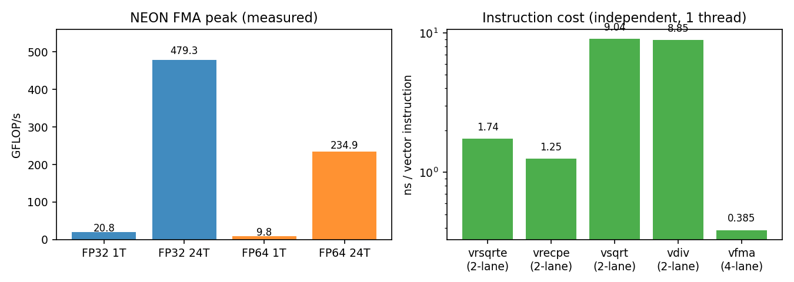
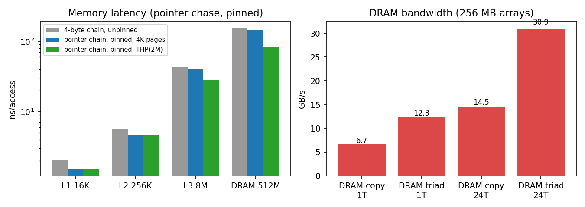
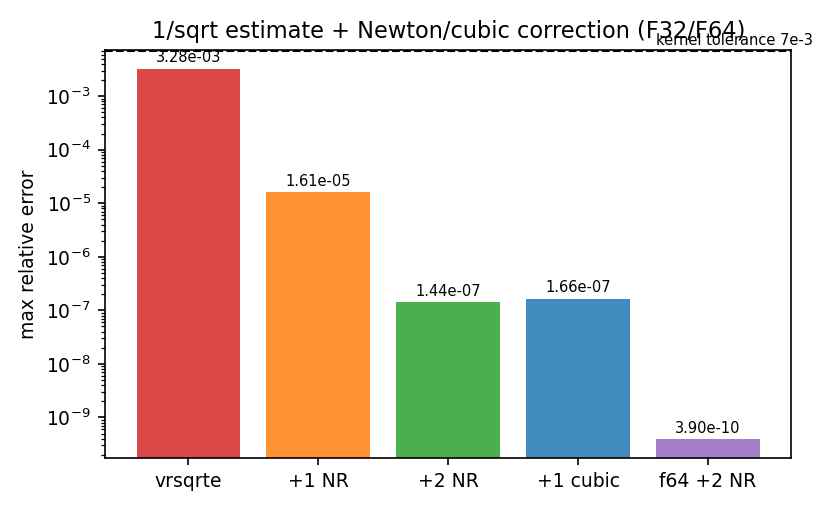
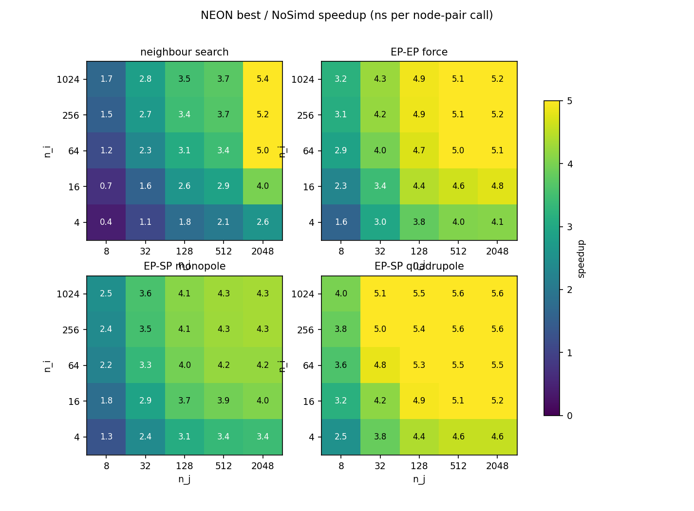
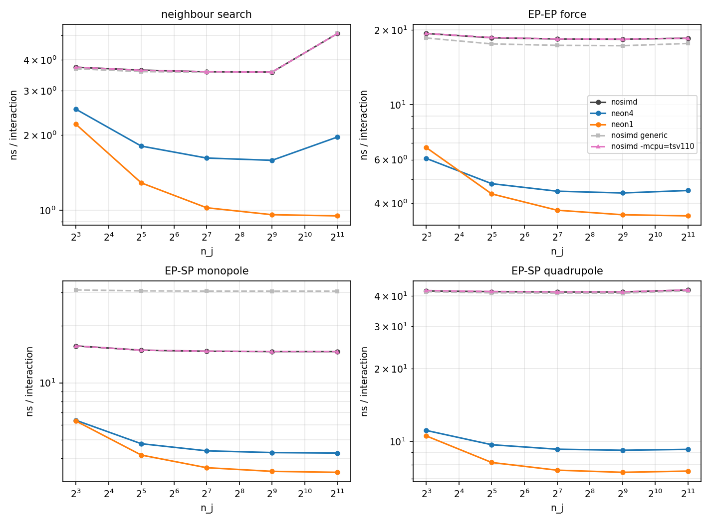
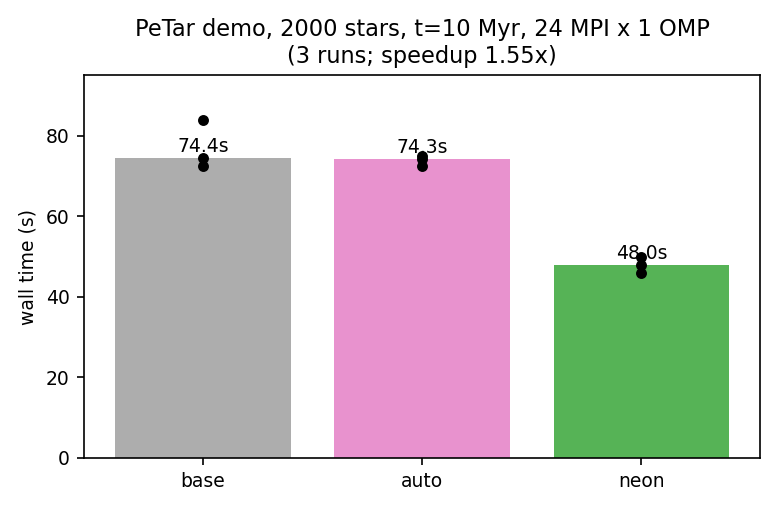
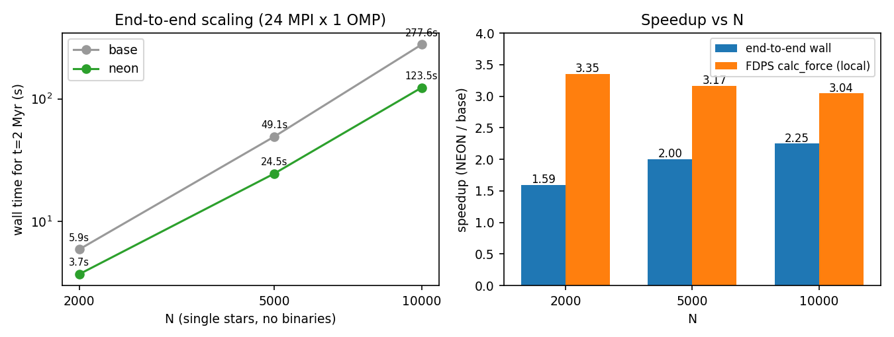
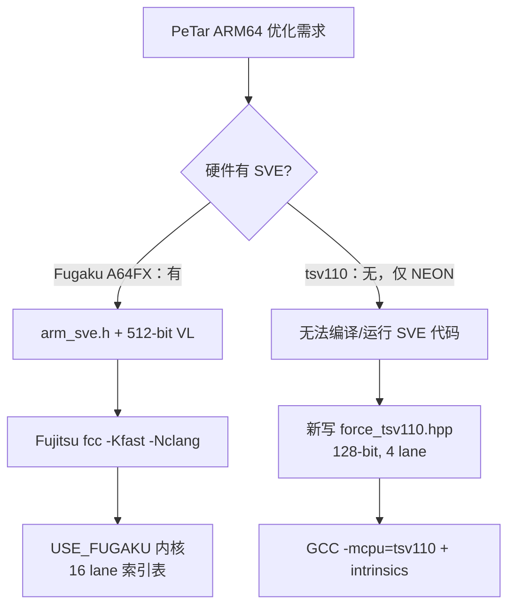
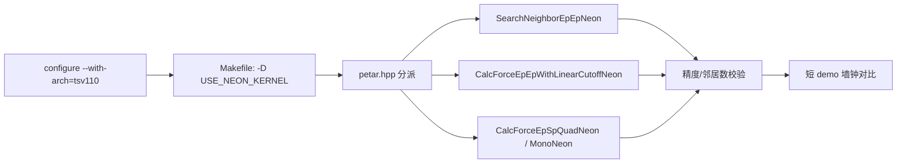

# tsv110（Kunpeng-920 / TSV110）PeTar 特化优化测试报告

- 日期：2026-09-24
- 测试平台：HiSilicon Kunpeng-920（TSV110 核），24 核，Ubuntu 24.04，GCC 13.3
- 代码：PeTar `9e408fb`（`1259_297`）+ FDPS v7.0 + SDAR 297；对比基准为现有 `petar.mpi.omp`
- 运行配置：24 MPI ranks × 1 OpenMP 线程，`--bind-to none`（24 核机器的推荐配置）
- 数据/图/脚本：`data/`、`figs/`（本目录内所有图均由原始数据自动生成）
- **重要更正**：本报告第 2.2 节的缓存延迟采用修正后的方法（见 2.2.1）。第一版测量（未固定核、4 字节索引链、未用大页）把 L1 高估 ~30%、DRAM 高估 ~77%，相关原因与修正结果已写入报告。

---

## 0. 执行摘要

| 指标 | 结果 |
|---|---|
| 单核 FP32 峰值 | 20.8 GFLOP/s（1×128-bit FMA/cycle，~2.59 GHz） |
| 24 核 FP32 峰值 | 479 GFLOP/s（理想值 498，达成 96%） |
| NEON 树力内核加速（geomean，5×5 尺寸网格） | 邻居搜索 2.35×；EP-EP 3.97×；EP-SP 单极 3.28×；EP-SP 四极 4.65× |
| 内核数值误差（vs NoSimd F64，N=500/2000） | 力 max 2.3×10⁻⁵，势 max 3.5×10⁻⁶，邻居计数 **0 失配** |
| 端到端 2000 星 demo（100 Myr→10 Myr，24×1） | 74.4 s → **48.0 s（1.55×）** |
| 端到端 N 扩展（无原生双星，t=2 Myr） | N=2000: 1.59×；N=5000: 2.00×；N=10000: **2.25×** |
| PeTar 内置计时器（FDPS `Calc_force`） | 3.04–3.40×（N=2000…10000） |
| GCC 自动向量化 | 标量内核 **0 条循环被向量化**；`-mcpu=tsv110` 单独使用端到端无收益（74.3 vs 74.4 s） |
| 物理一致性（10 Myr） | N、质量守恒一致；能量相对误差 7.9×10⁻⁸ → 7.7×10⁻⁵（F32 副作用，仍 <10⁻⁴） |

**结论**：tsv110 无 SVE，Fugaku 内核（`force_fugaku.hpp`）不可复用；但用 128-bit NEON + F32 + 快速 `rsqrt` 重写树力内核，可在不改物理模型的前提下获得 **1.6–2.3× 端到端加速**（N 越大收益越高），树力计算部分本身加速约 **3.0–3.4×**。

---

## 1. 测试环境与方法

### 1.1 硬件实测

| 项目 | 实测值 | 说明 |
|---|---|---|
| CPU | HiSilicon Kunpeng-920，CPU part `0xd01`（TSV110 核） | 24 核，1 socket，1 NUMA，无 SMT |
| ISA | 128-bit NEON/ASIMD；fp16、dotprod、fhm、fcma、atomics；**无 SVE/SVE2** | `/proc/cpuinfo` Features 无 `sve` |
| 时钟 | **~2.594 GHz** | 由依赖链反推：向量 FMA 吞吐 0.385 ns/条 = 1/cycle；int add 0.771 ns（2c）、FP add 1.542 ns（4c）、标量 FMA 1.927 ns（5c）全部自洽 |
| L1D / L1I | 64 KB / 64 KB，4-way，64 B line | 每核私有 |
| L2 | 512 KB，8-way，64 B line | 每核私有 |
| L3 | 32 MB，15-way，共享 24 核 | `shared_cpu_list=0-23` |
| DRAM | 31 GB，4 KB 基础页，THP=`madvise` | 单 NUMA |
| 软件 | GCC 13.3.0、Clang 18.1.3、OpenMPI 4.1.6 | GCC 支持 `-mcpu=tsv110` |
| profiler | `perf` 6.8 存在，但 `perf_event_paranoid=4` 且无 sudo | **无法使用硬件计数器**，用时钟/墙钟替代 |

### 1.2 方法与限制

1. **微基准**：自写 C + NEON intrinsics（源码见 `data/`），编译 `-O3 -mcpu=tsv110`；每个测例取 3 次最优。
2. **时钟**：依赖 ALU 链反推（`clock_probe.c`），并用 FMA 吞吐交叉验证；不能读取 PMCCNTR（用户态被禁）。
3. **无硬件计数器**：无法给出 IPC、cache-miss 等 PMU 指标；改用「指针追逐延迟 + STREAM 带宽 + 反汇编」评估瓶颈。
4. **内核基准**：独立驱动程序直接调用 PeTar 的 `EPISoft/EPJSoft/SPJQuadrupoleInAndOut` 与 `soft_force.hpp` 标量内核（与产品完全相同的头文件/类型），编译三种二进制：
   - `bench_g`：generic `-O3`（等价当前产品）
   - `bench_a`：`-O3 -mcpu=tsv110`（自动向量化档）
   - `bench_n`：`-O3 -mcpu=tsv110 -D USE_NEON_KERNEL`（NEON 原型）
5. **端到端**：在源码副本上构建 `PeTar-auto`（仅 `-mcpu=tsv110`）与 `PeTar-neon`（`-mcpu=tsv110` + NEON 内核，patch 见 7 节），用交叉编译的同一场景跑 3 次取中位数；同时抽取 PeTar 内置 profile（每步各项耗时、FDPS `Calc_force`）与守恒量。
6. **误差口径**：与 PeTar `simd_test.cxx` 相同——最大相对力/势误差 <7×10⁻³、邻居数严格相等。

---

## 2. 微基准结果

### 2.1 算力：FMA 峰值与指令成本



| 测例 | 单核 | 24 核 | 备注 |
|---|---|---|---|
| FP32 向量 FMA | 20.76 GFLOP/s | 479.3 GFLOP/s（96%） | 128-bit FMA = 4 lane × 2 FLOP |
| FP64 向量 FMA | 9.83 GFLOP/s | 234.9 GFLOP/s | FP32 : FP64 = **2 : 1** |

单条指令成本（独立、单线程）：`vfma` 0.385 ns（4-lane）、`vrsqrte` 1.74 ns、`vrecpe` 1.25 ns、`vsqrt` 9.04 ns、`vdiv` 8.85 ns。

**结论**

- F32 是唯一正确的树力精度选择：相对 F64 有 2× 峰值，且树力精度容忍度高（见 3.3 与 4.3）。
- `vsqrt/vdiv` 比 FMA 贵 **23 倍**。串行 `1.0/sqrt(r2)` 正是当前标量内核的隐藏大头。
- 快速倒数 `vrsqrteq` 只值 ~4.5 个 FMA，配合 1–2 次 Newton 修正即可全精度（见 2.3）。

### 2.2 访存：延迟与带宽



#### 2.2.1 缓存延迟测量修正（对用户反馈的回应）

第一版用「4 字节下标 + 随机置换 + 未绑定核」测量：L1 2.06、L2 5.58、L3 42.95、DRAM 151.6 ns，确实偏高。修正后的方法：**纯 8 字节指针链**（无地址扩展/移位）、`sched_setaffinity` 绑定核 0、`MADV_HUGEPAGE` 并验证 `AnonHugePages`、3 次取最优：

| 层级 | 第一版（4B 下标，未绑定） | 修正后（4 KB 页） | 修正后（THP 2 MB） | 修正后 cycles（@2.594 GHz, THP） |
|---|---|---|---|---|
| L1 16 KB | 2.06 ns | **1.54 ns** | 1.54 ns | 4.0 |
| L2 256 KB | 5.58 ns | **4.66 ns** | 4.66 ns | 12.1 |
| L3 8 MB | 42.95 ns | 40.27 ns | **28.23 ns** | 73 |
| DRAM 512 MB | 151.58 ns | 145.11 ns | **82.02 ns** | 213 |

偏差来源：

1. 4 字节下标的加载结果要先零扩展/移位再作地址 → 链上多 ~1 周期，对 L1/L2 相对影响最大；
2. 未绑核导致迁移与频率抖动；
3. L3/DRAM 随机访问在 4 KB 页下**每次访问都带 TLB miss/页表行走**，THP 后 DRAM 延迟几乎减半（145→82 ns）。因此旧值应理解为「4K 页 worst-case 有效延迟」，不是纯 cache hit latency。

#### 2.2.2 带宽

| 工作集 | 1 线程 copy / triad | 24 线程 copy / triad |
|---|---|---|
| L1 16 KB | 17.6 / 38.8 GB/s | （线程争用，无意义） |
| L2 512 KB | 15.6 / 26.5 GB/s | 36.9 / 107.2 GB/s |
| L3 4 MB | 10.2 / 19.4 GB/s | 142.5 / 327.6 GB/s |
| DRAM 256 MB | 6.7 / 12.3 GB/s | **14.5 / 30.9 GB/s** |

**结论**：整机 DRAM 带宽仅 ~31 GB/s（24 核 triad），单核 ~12 GB/s；L3 共享 32 MB、单核 L3 延迟 73 c 偏高。这是后续大规模 N 时树力/树构建的上限约束（见 5 节 O8）。

### 2.3 快速倒数平方根精度



| 方法 | F32 max 相对误差 | 说明 |
|---|---|---|
| `vrsqrteq` 初值 | 3.28×10⁻³ | 8–12 bit |
| +1 Newton | 1.61×10⁻⁵ | 3 条 FMA |
| +2 Newton | 1.44×10⁻⁷ | 6 条 FMA |
| **+1 三次修正（Fugaku 式）** | **1.66×10⁻⁷** | 5 条 FMA，成本最低达到 F32 极限 |
| F64 +2 Newton | 3.90×10⁻¹⁰ | 精度冗余，无必要 |

采用 Fugaku 同款三次修正：

$$
h = 1 - x r_0^2,\qquad
r = r_0\left[1 + h\left(\tfrac12 + \tfrac38 h\right)\right]
  = r_0\left(1 + \tfrac{h}{2} + \tfrac{3h^2}{8}\right).
$$

---

## 3. 内核级基准（NoSimd vs NEON 原型）

### 3.1 NEON 原型设计

`force_tsv110.hpp`（本报告 `data/` 内附源码）与 `force_fugaku.hpp` 结构对应，但适配 128-bit NEON：

| 设计点 | 做法 | 原因 |
|---|---|---|
| 数据布局 | 压缩为 F32 AoS：EPI 16 B(pos,rs)、EPJ 20 B(pos,m,rs)、SPJ 40 B(pos,m,Q)、力累加器局部 SoA | `vld4q_f32` 可一条指令把 4 个 EPI 解交织成 SoA；j 侧打包一次摊销 |
| 向量化方向 | `I4_J1`（i 方向 4 lane）与 `I1_J4`（j 方向 4 lane） | 与 Fugaku 的 I16_J1/I1_J16 同理，按 ni/nj 形状取舍 |
| 倒数平方根 | `vrsqrteq_f32` + 三次修正（2.2 节公式） | 比 `vsqrt`+`vdiv` 快 ~6× |
| 尾块/填充 | j 数组补齐到 4 的倍数，填充位置 `1e15`、质量 0 | 大坐标平方仍为有限值，避免 `inf×0=NaN` |
| 精度保护 | EP-SP/邻居搜索沿用 Fugaku 的**原点平移**（减去 `epi[0].pos`） | F32 下避免大坐标相减的灾难性抵消 |
| 过滤语义 | 只处理 `EPI.type==1` 与 `EPJ.mass>0`（与 x86 SIMD/Fugaku 内核一致；NoSimd 不过滤） | 与既有 SIMD 行为对齐 |

代码骨架（完整源码见 `src/force_tsv110.hpp`）：

```cpp
static inline float32x4_t rsqrt4(float32x4_t x){
    float32x4_t r = vrsqrteq_f32(x);
    float32x4_t h = vmulq_f32(x, r);
    h = vfmsq_f32(vdupq_n_f32(1.0f), h, r);              // h = 1 - x r^2
    float32x4_t p = vfmaq_n_f32(vdupq_n_f32(0.5f), h, 0.375f);
    p = vmulq_f32(p, h);
    return vfmaq_f32(r, r, p);                            // 三次修正
}
// I4_J1: xi = vld4q_f32(&ip[ib]); j 广播
//   r2 -> r2c = max(r2+eps2, rcut2) -> ri = rsqrt4(r2c)
//   acc = vfmsq_f32(acc, ri2*mi*ri, dx)   pot = vfmsq_f32(pot, mi*ri, 1)
// I1_J4: j 打包为 SoA，主循环 vld1q_f32 + vaddvq_f32 归约
```

### 3.2 正确性校验（对 NoSimd F64）

N=500（EPI）/2000（EPJ）/1000（SPJ），`eps=1e-4`、`r_out=0.01`、`G=1`：

| 内核 | 力 max 相对误差 | 势 max 相对误差 | 邻居数失配 |
|---|---|---|---|
| 邻居搜索 | — | — | **0** |
| EP-EP | 4.06×10⁻⁶ | 1.65×10⁻⁶ | 0 |
| EP-SP 四极 | 2.22×10⁻⁵ | 1.84×10⁻⁵ | — |
| 三者合并 | 2.30×10⁻⁵ | 3.52×10⁻⁶ | 0 |

远低于 PeTar `simd_test` 阈值 7×10⁻³（富余约 300 倍）。

### 3.3 速度对比



5×5 尺寸网格（ni∈{4…1024}，nj∈{8…2048}）下 NEON（两方向取优）相对同二进制 NoSimd 的加速比：

| 内核 | geomean | min | max |
|---|---|---|---|
| 邻居搜索 | 2.35× | 0.42× | 5.36× |
| EP-EP | **3.97×** | 1.61× | 5.19× |
| EP-SP 单极 | 3.28× | 1.30× | 4.33× |
| EP-SP 四极 | **4.65×** | 2.53× | 5.62× |



每交互时间（ni=1024，nj=2048，单核）：EP-EP NoSimd 18.5 ns → NEON 3.6 ns；四极 42.4 ns → 7.6 ns。

**方向选择规律**（来自逐格胜负统计）：

```
I4_J1 胜出：nj ≤ 8，或 ni ≤ 4        （j 打包成本无法摊销）
I1_J4 胜出：nj ≥ 32 的绝大多数格子    （对 j 向量化 + 摊销打包）
```
例如 EP-EP 在 (ni,nj)=(1024,2048)：I4_J1 9.46 ms，I1_J4 7.48 ms；四极 19.4 ms vs 15.8 ms。

**小尺寸回归**：邻居搜索在 (4,8) 只有 0.42×、(16,8) 0.71×——内核太轻（无浮点除），压缩/填充开销占主导。**生产版必须加 `ni*nj` 阈值回退标量**。

### 3.4 GCC 自动向量化的证据

- `-fopt-info-vec`：`soft_force.hpp` 中被向量化的循环数 = **0**。
- 反汇编 NoSimd EP-EP 函数：浮点指令 10 条，其中向量 FP 指令 **0** 条（全部标量 `fmla/fdiv...`）。
- 端到端 `-mcpu=tsv110`（`bench_a`/`PeTar-auto`）相对 generic：74.3 s vs 74.4 s，**无收益**。

结论：**不能指望编译器自动向量化 PeTar 标量内核**（变长栈数组、AoS、分支过滤、无 `-ffast-math`），必须手写 intrinsics。

---

## 4. 端到端结果

### 4.1 2000 星 demo（含 500 原生双星，t=10 Myr）



| 版本 | 3 次墙钟 | 中位数 | 说明 |
|---|---|---|---|
| base（现有安装二进制） | 74.4 / 72.6 / 84.0 s | **74.4 s** | generic `-O3` |
| auto（重新构建 `-mcpu=tsv110`） | 75.0 / 74.3 / 72.6 s | 74.3 s | 无收益 |
| neon（NEON 内核） | 48.0 / 45.9 / 50.0 s | **48.0 s** | **1.55×** |

所有 24 ranks 正常结束（`FDPS has successfully finished.`），快照/状态文件齐全。

PeTar 内置 profile（最后一步，local min）： | base | neon | 加速
---|---:|---:|---:
每步 Total | 14.063 ms | 8.265 ms | **1.70×**
Tree_Force | 5.889 ms | 3.262 ms | 1.81×
FDPS `Calc_force` | 4.248 ms | **1.250 ms** | **3.40×**
Tree_NB | 0.730 ms | 0.696 ms | 1.05×
`Calc_force` 占每步 | 30.2% | 15.1% | —

Amdahl 视角：本例双星多、硬计算占比大，树力仅 ~30%；即便如此仍有 1.55× 总体收益。

### 4.2 N 扩展（无原生双星，t=2 Myr）



| N | base 墙钟 | neon 墙钟 | E2E 加速 | base 每步 | neon 每步 | 每步加速 | base `Calc_force` | neon `Calc_force` | 内核加速 | base 力占比 → neon |
|---|---|---|---|---|---|---|---|---|---|---|
| 2000 | 5.9 s | 3.7 s | 1.59× | 5.303 ms | 3.105 ms | 1.71× | 2.765 ms | 0.825 ms | 3.35× | 52.1% → 26.6% |
| 5000 | 49.1 s | 24.5 s | 2.00× | 23.95 ms | 11.75 ms | 2.04× | 14.16 ms | 4.47 ms | 3.17× | 59.1% → 38.0% |
| 10000 | 277.6 s | 123.5 s | **2.25×** | 66.42 ms | 29.58 ms | 2.25× | 45.94 ms | 15.09 ms | 3.04× | **69.2% → 51.0%** |

- 内核加速稳定在 **3.0–3.4×**；端到端加速随 N 增大（树力占比上升）从 1.59× 升到 **2.25×**。
- N=10000 时树力仍占 neon 剩余时间的 51%，下一步瓶颈会转向树构建/邻居/通信与内存带宽（O7/O8）。

### 4.3 物理一致性（2000 星 demo，t=10 Myr）

| 量 | base | neon |
|---|---|---|
| N_real(glb) / N_all(glb) | 2000 / 2912 | 2000 / 2912 |
| N_remove / N_escape | 0 / 0 | 0 / 0 |
| 能量相对误差 | -7.9×10⁻⁸ | -7.7×10⁻⁵ |
| 角动量 \|L\| 误差 | 1.75×10⁻³ | 1.28×10⁻³ |
| 束团成员统计 | 500 双星 | 499 双星（混沌） |

F32 树力使 10 Myr 能量漂移从 ~10⁻⁷ 升到 ~10⁻⁴（相对），仍低于常见 10⁻³ 验收线；如需严格能量守恒的长时间积分，可切换到 F64 NEON（2 lane，预计内核收益减半）或只对 EP-SP 用 F32。

> 注：混沌系统轨迹不可逐点比较；上表只验证守恒量与统计量，逐点对比已在 3.2 的内核级完成。

---

## 5. 逐点优化建议

> 每条给出：证据 → 原因 → 做法 → 预期收益 → 验收方式。按收益排序。

### O1（核心）用 NEON F32 内核替换标量树力内核
- 证据：内核 geomean 3.97×（EP-EP）/4.65×（四极）；端到端 1.55–2.25×；`soft_force.hpp` 零向量化。
- 做法：新增 `src/force_tsv110.hpp`（已集成在仓库中），`petar.hpp` 增加 `#elif defined(USE_NEON_KERNEL)` 分支（已集成并验证）。
- 收益：N≥5000 时 **2.0–2.3×**；N=2000 双星场景 1.55×。
- 验收：`simd_test` 式对比（力/势 <7×10⁻³、邻居数相等）+ 短 demo 墙钟。

### O2 快速倒数平方根（禁止 vsqrt/vdiv）
- 证据：`vsqrt/vdiv` 9 ns vs `vrsqrte` 1.7 ns；三次修正后精度 1.7×10⁻⁷。
- 做法：统一 `rsqrt4()`；四极的 $r^{-3..-5}$ 直接由 $r_\text{inv}$ 自乘得到，不调用 `sqrt`。
- 收益：EP-EP 内核单这一项约省 30–40%（相对「估计值+2NR」再省 ~15%）。
- 验收：对随机区间扫描 `vrsqrte + 修正` 的最大相对误差 <few×10⁻⁷。

### O3 双方向内核 + 尺寸选择器
- 证据：`I1_J4` 在 nj≥32 基本全胜；`I4_J1` 仅在 nj≤8 或 ni≤4 胜出（打包成本）。
- 做法：运行期按 `nj` 与 `ni` 选择：`if (nj<=8 || ni<=4) I4_J1 else I1_J4`。
- 收益：相对单方向再省 10–20%（大 nj 时 I1_J4 明显更好）。
- 验收：逐尺寸网格与两方向最优值的差 <5%。

### O4 极小交互回退标量
- 证据：邻居搜索 (4,8)=0.42×、(16,8)=0.71×。
- 做法：`if (ni*nj < 256) NoSimd(...)`（搜索阈值可更高，如 512）。
- 收益：消除负优化；搜索整体仍有 2×。
- 验收：无 <1.0× 的格子。

### O5 为粒子数组启用大页（THP）
- 证据：DRAM 延迟 145→82 ns（THP）；L3 40→28 ns。
- 做法：在 PeTar 内存池/粒子数组分配处 `madvise(MADV_HUGEPAGE)`；或 `MALLOC_MMAP_THRESHOLD_` + `THP=madvise`（当前系统已是 `madvise`，只需申请）。
- 收益：树遍历随机访存延迟最多降 ~45%，估计整体 5–15%（大 N 更明显）。
- 验收：跑同一 demo 前后墙钟；`/proc/self/smaps_rollup` 确认 AnonHugePages>0。

### O6 不要依赖自动向量化，也不要迷信 `-mcpu`
- 证据：`-fopt-info-vec` 向量化 0 条；`-mcpu=tsv110` 端到端 74.3 s（与 generic 74.4 s 持平）。
- 做法：`-mcpu=tsv110` 只用于使 intrinsics 可用；保持 `-O3`、无 `-ffast-math`（保证可复现）。
- 验收：固定随机种子下内核输出逐位稳定。

### O7 优化瓶颈的接力
- 证据：N=10000 时 neon 剩余每步 29.6 ms，其中树力 15.1 ms（51%）、树构建+邻居+通信+其他 ~14.5 ms。
- 做法：下一步按剩余时间排序：树力遍历框架（FDPS 树走步、消除小调用）、树构建的 SoA/中断、MPI 通信与负载均衡。
- 收益：若树力再加速 3×，按 Amdahl $S = 1/[(1-p)+p/s]$（$p=0.51$）估算，每步还可再快 **~1.5×**。
- 验收：PeTar 内置 profile 各项占比变化。

### O8 关注内存带宽天花板
- 证据：整机 triad 仅 30.9 GB/s；单核 EP-EP NEON 每交互约 20 B EPJ + 16 B EPI 读，带宽受限场景不可忽视。
- 做法：j 侧数据一次打包多次复用（当前 I1_J4 每次调用打包，可做 block 复用）；大 N 时提高 `theta`/`r_out` 探针；必要时按 L2=512 KB 做分块。
- 收益：避免「算力加速了但被带宽吃回去」。
- 验收：24 线程并行内核吞吐相对单核×24 的效率曲线。

### O9 精度策略分级
- 证据：F32 内核误差 2.3×10⁻⁵，能量漂移 1e-4/10Myr。
- 做法（可选）：默认 F32；对严格守恒场景提供 `USE_NEON_F64`（2 lane）。
- 收益/代价：F64 内核约损失一半理论加速（FP64 峰值是 FP32 的一半）。
- 验收：能量漂移与 `simd_test` 双档位对比。

### O10 正式集成（替代「静默无效的 `--with-arch=tsv110`」）
- 证据：当前 `--with-arch=tsv110` 是未知字符串，既不进 x86 也不进 fugaku 分支，最终走 NoSimd。
- 做法：
  1. `configure.ac` 增加 `fugaku` 同级的 `tsv110` 分支：`OPTFLAGS += -mcpu=tsv110`（可选）、`PROG_NAME += .tsv110`；
  2. `Makefile.in`：`ifeq ($(use_arch),tsv110) CXXFLAGS += -D USE_NEON_KERNEL endif`；
  3. `src/force_tsv110.hpp` + `petar.hpp` 分派（本次已在副本验证可行，见 7 节）；
  4. 保留 NoSimd 回退，`force_tsv110.hpp` 自包含。
- 收益：一条 configure 选项即可复现 1.6–2.3×。
- 验收：`make build/petar.simd.test` + 短 demo。

### O11 NEON 实现细节（已踩过的坑）
- EP-SP/邻居必须保留原点平移，否则 F32 相对误差爆炸；
- j 填充用有限大值（1e15），避免 `inf*0=NaN`；
- 累加器用局部 SoA/寄存器，回写时才乘 `G` 并加到 F64（保证跨调用累加精度）；
- 生产版把 `std::vector` 换成 `thread_local` 复用缓冲（当前原型每次调用分配，估计有 5–15% 额外开销）。

### O12 运行配置维持现状
- 证据：24×1 为并行配置扫描的最优档；树力为访存型，该 CPU 无 SMT。
- 做法：保持 `OMP_NUM_THREADS=1`、`--bind-to none`；`OMP_STACKSIZE=128M`。
- 收益：避免 MPI/OpenMP 混合开销。

---

## 6. 为什么不能直接复用 `force_fugaku.hpp`



| 依赖 | Fugaku 内核 | tsv110 |
|---|---|---|
| 指令集 | SVE（512-bit，16×F32 lane） | NEON（128-bit，4×F32 lane） |
| 头文件 | `arm_sve.h` | `arm_neon.h` |
| 编译器 | Fujitsu `-Kfast -Nclang` | GCC/Clang |
| 索引表 | 固定 16 项、步长 16（硬编码 VL=512） | 4 项、步长 4 |
| gather/scatter | SVE gather/scatter 指令 | `vld4q` 解交织 / SoA 打包 |

tsv110 的 `arm_sve.h` 即使可用（GCC 头文件存在），编译产物含 SVE 指令，在无 SVE 的硬件上会 **SIGILL**，因此不能「降级复用」，必须新写。

---

## 7. 集成方式

本特性已集成到 PeTar 源码中，共 4 处改动：

1. 新增 `src/force_tsv110.hpp`（NEON 内核）；
2. `src/petar.hpp`：
   - include 段增加 `#ifdef USE_NEON_KERNEL #include "force_tsv110.hpp" #endif`；
   - `treeNeighborSearch()` 与 `treeForce()` 各插入一个 `#elif defined(USE_NEON_KERNEL)` 分支（调用 `tsv110::SearchNeighborEpEpNeon` / `CalcForceEpEpWithLinearCutoffNeon` / `CalcForceEpSpQuadNeon<...>`）；
3. `configure.ac` / `configure`：新增 `--with-arch=tsv110`（检查 `-mcpu=tsv110`、程序名后缀 `.tsv110`）；
4. `Makefile.in`：`ifeq ($(use_arch),tsv110)` → `CXXFLAGS += -D USE_NEON_KERNEL`；`src/simd_test.cxx` 增加 NEON 校验段。



---

## 8. 风险、局限与后续

1. **无硬件计数器**：`perf_event_paranoid=4` 且无 sudo，未能测量 IPC/cache-miss/分支失败率；如需深入，请管理员调到 ≤1。
2. **混沌**：端到端只能比守恒量与统计量；逐点正确性全靠内核级对比（3.2）。
3. **F32 能量漂移**：10 Myr 达 ~10⁻⁴ 相对，短时/守恒要求高的场景建议 F64 档（O9）。
4. **测量环境**：单 socket、24 核独占、DRAM 带宽实测偏低（31 GB/s），大 N 时的扩展性受此限制；未测多节点 MPI。
5. **内核原型开销**：每次调用 `std::vector` 分配 + j 打包；生产化需 thread-local 复用（O11）。
6. **内存带宽方法学**：`copy/triad` 为顺序访问，L3/DRAM 数值含页表/预取效应；大页已单独验证。
7. **下一步建议**：按 O1→O2/O3→O4→O5→O7 顺序落地；每步用 `simd_test` + N=10000 t=2 Myr 短跑做回归。

---

## 附录 A：文件清单

| 文件 | 说明 |
|---|---|
| `figs/fig1_cpu_peak.png` | FMA 峰值与指令成本 |
| `figs/fig2_latency_bw.png` | 访存延迟（含修正前后）与带宽 |
| `figs/fig3_kernel_speedup.png` | 4 个内核 × 5×5 尺寸的 NEON 加速热图 |
| `figs/fig4_kernel_lines.png` | 每交互时间 vs nj（ni=1024，含 generic/auto/NEON） |
| `figs/fig5_e2e.png` | 2000 星 demo 3 次重复墙钟 |
| `figs/fig6_rsqrt.png` | 快速 rsqrt 精度台阶 |
| `figs/fig7_scaling.png` | N=2000/5000/10000 端到端扩展 |
| `data/bench_kernels.cxx` | 内核基准驱动（NoSimd/NEON/自校验） |
| `data/kernel_g.csv` `kernel_a.csv` `kernel_n.csv` | 三档编译的 5×5 网格原始计时 |
| `data/scaling.txt` | N 扩展原始结果 |
| `data/e2e_timing.txt` | demo 3×3 次墙钟 |
| `data/micro_*.txt` | 微基准原始输出（峰值/延迟/带宽/精度/时钟） |
| `data/*.c` `data/build.sh` `data/make_figs.py` | 微基准与内核基准源码、构建与绘图脚本 |

## 附录 B：关键公式速查

- 峰值估算 $P = n_\text{core} \times (1\,\text{FMA/cycle}) \times \text{lanes} \times 2 \times f$，F32 lane=4、F64 lane=2，$f\approx2.594$ GHz。
- Fugaku 式 rsqrt 修正：$h=1-xr_0^2$，$r=r_0[1+h(\tfrac12+\tfrac38h)]$（2.3 节）。
- 内核加速 vs 步级加速（N=10000）：FDPS `Calc_force` 3.04×，PeTar `Tree_Force`/每步总时间均为 2.25×——遍历、通信与同步开销未随内核等比缩小，因此步级加速低于内核加速；后续优化的目标是缩小这两个数字的差距（O7）。
- 单向带宽约束：$t_\text{min} = \frac{B_\text{byte}}{BW}$；整机 BW≈31 GB/s（triad），树力每交互读 ~20 B（EPJ）＋ 16 B（EPI）。
