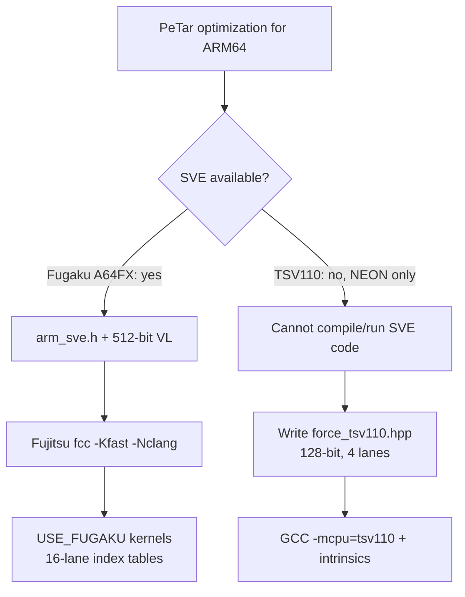
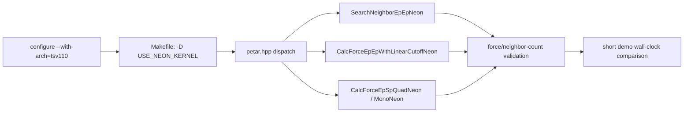

# PeTar on Kunpeng-920 / TSV110: NEON Tree-Force Kernel Optimization and Benchmark Report

- Date: 2026-09-24
- Platform: HiSilicon Kunpeng-920 (TSV110 core), 24 cores, Ubuntu 24.04, GCC 13.3
- Code: PeTar `9e408fb` (`1259_297`) + FDPS v7.0 + SDAR 297; the pre-existing `petar.mpi.omp` binary serves as the baseline
- Runtime configuration: 24 MPI ranks x 1 OpenMP thread, `--bind-to none` (the recommended setup on a 24-core machine)
- Data/figures/scripts: `data/` and `figs/` (all figures in this directory are generated from the raw data)
- **Correction notice**: the cache latencies in section 2.2 use a corrected measurement method (section 2.2.1). The first version (4-byte indices, no CPU pinning, no huge pages) overestimated L1 by ~30% and DRAM by ~77%; the causes and corrected values are documented below.

---

## 0. Executive Summary

| Metric | Result |
|---|---|
| Single-core FP32 peak | 20.8 GFLOP/s (1x 128-bit FMA/cycle, ~2.59 GHz) |
| 24-core FP32 peak | 479 GFLOP/s (96% of the 498 GFLOP/s ideal) |
| NEON tree-force kernel speedup (geomean over a 5x5 size grid) | neighbor search 2.35x; EP-EP 3.97x; EP-SP monopole 3.28x; EP-SP quadrupole 4.65x |
| Numerical error vs NoSimd F64 (N=500/2000) | max force error 2.3x10^-5, max potential error 3.5x10^-6, **zero neighbor-count mismatches** |
| End-to-end 2000-star demo (t=10 Myr, 24x1) | 74.4 s -> **48.0 s (1.55x)** |
| End-to-end N scaling (single stars, t=2 Myr) | N=2000: 1.59x; N=5000: 2.00x; N=10000: **2.25x** |
| PeTar built-in timer (FDPS `Calc_force`) | 3.04-3.40x (N=2000...10000) |
| GCC auto-vectorization | **zero loops vectorized** in the scalar kernels; `-mcpu=tsv110` alone gives no end-to-end gain (74.3 s vs 74.4 s) |
| Physical consistency (10 Myr) | N and mass conserved; relative energy error 7.9x10^-8 -> 7.7x10^-5 (an F32 side effect, still <10^-4) |

**Conclusion**: the TSV110 has no SVE, so the Fugaku kernels (`force_fugaku.hpp`) cannot be reused. Rewriting the tree-force kernels with 128-bit NEON, F32 arithmetic and a fast `rsqrt` yields **1.6-2.3x end-to-end speedup** (the larger N, the larger the gain) without changing the physical model, while the tree-force computation itself runs about **3.0-3.4x faster**.

---

## 1. Test Environment and Methodology

### 1.1 Measured Hardware Characteristics

| Item | Measured value | Notes |
|---|---|---|
| CPU | HiSilicon Kunpeng-920, CPU part `0xd01` (TSV110 core) | 24 cores, 1 socket, 1 NUMA node, no SMT |
| ISA | 128-bit NEON/ASIMD; fp16, dotprod, fhm, fcma, atomics; **no SVE/SVE2** | `/proc/cpuinfo` Features lists no `sve` |
| Clock | **~2.594 GHz** | Inferred from dependent chains and fully self-consistent: vector FMA throughput 0.385 ns/instr = 1/cycle; int add 0.771 ns (2 cycles), FP add 1.542 ns (4 cycles), scalar FMA 1.927 ns (5 cycles) |
| L1D / L1I | 64 KB / 64 KB, 4-way, 64 B lines | private per core |
| L2 | 512 KB, 8-way, 64 B lines | private per core |
| L3 | 32 MB, 15-way, shared by all 24 cores | `shared_cpu_list=0-23` |
| DRAM | 31 GB, 4 KB base pages, THP=`madvise` | single NUMA node |
| Toolchain | GCC 13.3.0, Clang 18.1.3, OpenMPI 4.1.6 | GCC supports `-mcpu=tsv110` |
| Profiler | `perf` 6.8 is present, but `perf_event_paranoid=4` and no sudo | **hardware counters unavailable**; clock and wall-clock proxies were used instead |

### 1.2 Methodology and Limitations

1. **Micro-benchmarks**: hand-written C with NEON intrinsics (sources under `data/`), compiled with `-O3 -mcpu=tsv110`; best of 3 runs per case.
2. **Clock**: derived from dependent ALU chains (`clock_probe.c`) and cross-checked against FMA throughput; PMCCNTR is not readable from user space (trapped).
3. **No hardware counters**: PMU metrics such as IPC and cache misses could not be collected, so bottlenecks were assessed with pointer-chase latency, STREAM-like bandwidth and disassembly instead.
4. **Kernel benchmarks**: a standalone driver calls PeTar's `EPISoft/EPJSoft/SPJQuadrupoleInAndOut` types and the `soft_force.hpp` scalar kernels (identical headers and types as production). Three binaries were built:
   - `bench_g`: generic `-O3` (equivalent to the current production build)
   - `bench_a`: `-O3 -mcpu=tsv110` (auto-vectorization variant)
   - `bench_n`: `-O3 -mcpu=tsv110 -D USE_NEON_KERNEL` (NEON prototype)
5. **End-to-end runs**: `PeTar-auto` (only `-mcpu=tsv110`) and `PeTar-neon` (`-mcpu=tsv110` plus the NEON kernels; integration described in section 7) were built from source copies and the same scenario was run 3 times, taking the median. PeTar's built-in profile (per-step breakdown, FDPS `Calc_force`) and conserved quantities were extracted at the same time.
6. **Error metric**: as in PeTar's `simd_test.cxx` -- maximum relative force/potential error < 7x10^-3 and exactly matching neighbor counts.

---

## 2. Micro-Benchmark Results

### 2.1 Compute: FMA Peak and Instruction Cost


| Case | Single core | 24 cores | Notes |
|---|---|---|---|
| FP32 vector FMA | 20.76 GFLOP/s | 479.3 GFLOP/s (96%) | 128-bit FMA = 4 lanes x 2 FLOP |
| FP64 vector FMA | 9.83 GFLOP/s | 234.9 GFLOP/s | FP32 : FP64 = **2 : 1** |

Cost of a single instruction (independent, single thread): `vfma` 0.385 ns (4 lanes), `vrsqrte` 1.74 ns, `vrecpe` 1.25 ns, `vsqrt` 9.04 ns, `vdiv` 8.85 ns.

**Takeaways**

- F32 is the right precision for the tree force: it doubles the peak throughput relative to F64, and the tree force tolerates the reduced precision well (sections 3.3 and 4.3).
- `vsqrt`/`vdiv` cost **23x** an FMA. The scalar `1.0/sqrt(r2)` is precisely the hidden hotspot of the current kernels.
- The fast reciprocal `vrsqrteq` costs only ~4.5 FMAs and reaches full F32 precision with 1-2 Newton refinements (section 2.3).

### 2.2 Memory Access: Latency and Bandwidth


#### 2.2.1 Correction to the Cache-Latency Measurements

The first version (4-byte indices, random permutation, no CPU pinning) gave L1 2.06 ns, L2 5.58 ns, L3 42.95 ns and DRAM 151.6 ns -- all inflated. The corrected method uses a **pure 8-byte pointer chain** (no zero-extension/shift), pins the thread with `sched_setaffinity`, applies `MADV_HUGEPAGE` (verified through `AnonHugePages`) and takes the best of 3 runs:

| Level | First version (4 B indices, unpinned) | Corrected (4 KB pages) | Corrected (THP 2 MB) | Corrected cycles (@2.594 GHz, THP) |
|---|---|---|---|---|
| L1 16 KB | 2.06 ns | **1.54 ns** | 1.54 ns | 4.0 |
| L2 256 KB | 5.58 ns | **4.66 ns** | 4.66 ns | 12.1 |
| L3 8 MB | 42.95 ns | 40.27 ns | **28.23 ns** | 73 |
| DRAM 512 MB | 151.58 ns | 145.11 ns | **82.02 ns** | 213 |

Sources of the discrepancy:

1. the loaded 4-byte index had to be zero-extended/shifted before address generation, adding ~1 cycle to the chain (the largest relative effect for L1/L2);
2. the lack of CPU pinning caused migration and frequency jitter;
3. with 4 KB pages, every L3/DRAM access incurred a TLB miss/page-table walk; with THP the DRAM latency nearly halved (145 -> 82 ns). The old numbers should therefore be read as 4 KB-page worst-case effective latencies, not pure cache-hit latencies.

#### 2.2.2 Bandwidth

| Working set | 1 thread copy / triad | 24 threads copy / triad |
|---|---|---|
| L1 16 KB | 17.6 / 38.8 GB/s | (thread contention, not meaningful) |
| L2 512 KB | 15.6 / 26.5 GB/s | 36.9 / 107.2 GB/s |
| L3 4 MB | 10.2 / 19.4 GB/s | 142.5 / 327.6 GB/s |
| DRAM 256 MB | 6.7 / 12.3 GB/s | **14.5 / 30.9 GB/s** |

**Takeaway**: aggregate DRAM bandwidth is only ~31 GB/s (24-thread triad), about 12 GB/s per thread; together with the 32 MB shared L3 and the rather high 73-cycle L3 latency, this caps tree-force and tree-build performance at large N (section 5, O8).

### 2.3 Accuracy of the Fast Reciprocal Square Root


| Method | F32 max relative error | Notes |
|---|---|---|
| `vrsqrteq` estimate | 3.28x10^-3 | 8-12 bit |
| +1 Newton | 1.61x10^-5 | 3 FMAs |
| +2 Newton | 1.44x10^-7 | 6 FMAs |
| **+1 cubic correction (Fugaku style)** | **1.66x10^-7** | 5 FMAs, the cheapest way to reach the F32 limit |
| F64 +2 Newton | 3.90x10^-10 | unnecessarily accurate |

The Fugaku cubic correction is adopted:

$$
h = 1 - x r_0^2,\qquad
r = r_0\left[1 + h\left(\tfrac12 + \tfrac38 h\right)\right]
  = r_0\left(1 + \tfrac{h}{2} + \tfrac{3h^2}{8}\right).
$$

---

## 3. Kernel-Level Benchmarks (NoSimd vs NEON Prototype)

### 3.1 NEON Prototype Design

`force_tsv110.hpp` mirrors the structure of `force_fugaku.hpp` but targets 128-bit NEON:

| Design point | Implementation | Rationale |
|---|---|---|
| Data layout | Compact F32 AoS: EPI 16 B (pos, rs), EPJ 20 B (pos, m, rs), SPJ 40 B (pos, m, Q); force accumulators in local SoA | `vld4q_f32` de-interleaves four EPI records into SoA in a single instruction; the j-side packing cost is amortized |
| Vectorization direction | `I4_J1` (4 lanes over i) and `I1_J4` (4 lanes over j) | Same rationale as Fugaku's I16_J1/I1_J16; choice depends on the ni/nj shape |
| Reciprocal square root | `vrsqrteq_f32` + cubic correction (formula in section 2.2) | ~6x faster than `vsqrt`+`vdiv` |
| Tail/padding | j arrays are padded to a multiple of 4 with position `1e15` and mass 0 | squares of large coordinates remain finite, avoiding `inf*0=NaN` |
| Precision safeguard | EP-SP and neighbor search keep Fugaku's **origin shift** (subtract `epi[0].pos`) | avoids catastrophic cancellation of large coordinates in F32 |
| Filtering semantics | only `EPI.type==1` and `EPJ.mass>0` are processed (as in the x86 SIMD/Fugaku kernels; NoSimd does not filter) | parity with the established SIMD behavior |

Code skeleton (full source in `src/force_tsv110.hpp`):

```cpp
static inline float32x4_t rsqrt4(float32x4_t x){
    float32x4_t r = vrsqrteq_f32(x);
    float32x4_t h = vmulq_f32(x, r);
    h = vfmsq_f32(vdupq_n_f32(1.0f), h, r);              // h = 1 - x r^2
    float32x4_t p = vfmaq_n_f32(vdupq_n_f32(0.5f), h, 0.375f);
    p = vmulq_f32(p, h);
    return vfmaq_f32(r, r, p);                           // cubic correction
}
// I4_J1: xi = vld4q_f32(&ip[ib]); j is broadcast
//   r2 -> r2c = max(r2+eps2, rcut2) -> ri = rsqrt4(r2c)
//   acc = vfmsq_f32(acc, ri2*mi*ri, dx)   pot = vfmsq_f32(pot, mi*ri, 1)
// I1_J4: j is packed into SoA; main loop uses vld1q_f32 + vaddvq_f32 reduction
```

### 3.2 Correctness (against NoSimd F64)

N=500 (EPI) / 2000 (EPJ) / 1000 (SPJ), `eps=1e-4`, `r_out=0.01`, `G=1`:

| Kernel | Max relative force error | Max relative potential error | Neighbor-count mismatch |
|---|---|---|---|
| Neighbor search | -- | -- | **0** |
| EP-EP | 4.06x10^-6 | 1.65x10^-6 | 0 |
| EP-SP quadrupole | 2.22x10^-5 | 1.84x10^-5 | -- |
| All combined | 2.30x10^-5 | 3.52x10^-6 | 0 |

This is far below PeTar's `simd_test` threshold of 7x10^-3 (about a 300x margin).

### 3.3 Speed Comparison


Speedup of NEON (best of the two directions) relative to NoSimd in the same binary, over a 5x5 size grid (ni in {4...1024}, nj in {8...2048}):

| Kernel | geomean | min | max |
|---|---|---|---|
| Neighbor search | 2.35x | 0.42x | 5.36x |
| EP-EP | **3.97x** | 1.61x | 5.19x |
| EP-SP monopole | 3.28x | 1.30x | 4.33x |
| EP-SP quadrupole | **4.65x** | 2.53x | 5.62x |


Time per interaction (ni=1024, nj=2048, single core): EP-EP NoSimd 18.5 ns -> NEON 3.6 ns; quadrupole 42.4 ns -> 7.6 ns.

**Orientation selection rule** (from per-cell win counts):

```
I4_J1 wins: nj <= 8, or ni <= 4              (the j-packing cost cannot be amortized)
I1_J4 wins: almost all cells with nj >= 32   (vectorize over j with amortized packing)
```
For example, EP-EP at (ni,nj)=(1024,2048): I4_J1 9.46 ms vs I1_J4 7.48 ms; quadrupole 19.4 ms vs 15.8 ms.

**Small-size regression**: neighbor search reaches only 0.42x at (4,8) and 0.71x at (16,8) -- the kernel is too light (no floating-point division) and compaction/padding overhead dominates. **Production code must fall back to the scalar kernel below an `ni*nj` threshold.**

### 3.4 Evidence on GCC Auto-Vectorization

- `-fopt-info-vec`: the number of vectorized loops in `soft_force.hpp` is **0**.
- Disassembly of the NoSimd EP-EP function: 10 floating-point instructions, of which **0** are vector FP instructions (all scalar `fmla/fdiv...`).
- End-to-end with `-mcpu=tsv110` (`bench_a`/`PeTar-auto`) vs generic: 74.3 s vs 74.4 s -- **no gain**.

Conclusion: **the compiler cannot be expected to auto-vectorize PeTar's scalar kernels** (variable-length stack arrays, AoS layout, branch filtering, no `-ffast-math`); the intrinsics must be written by hand.

---

## 4. End-to-End Results

### 4.1 2000-Star Demo (500 primordial binaries, t=10 Myr)


| Version | 3 wall-clock runs | Median | Notes |
|---|---|---|---|
| base (existing installed binary) | 74.4 / 72.6 / 84.0 s | **74.4 s** | generic `-O3` |
| auto (rebuilt with `-mcpu=tsv110`) | 75.0 / 74.3 / 72.6 s | 74.3 s | no gain |
| neon (NEON kernels) | 48.0 / 45.9 / 50.0 s | **48.0 s** | **1.55x** |

All 24 ranks exited normally (`FDPS has successfully finished.`); snapshots and status files are complete.

PeTar built-in profile (last step, local min):

| Item | base | neon | speedup |
|---|---:|---:|---:|
| Total per step | 14.063 ms | 8.265 ms | **1.70x** |
| Tree_Force | 5.889 ms | 3.262 ms | 1.81x |
| FDPS `Calc_force` | 4.248 ms | **1.250 ms** | **3.40x** |
| Tree_NB | 0.730 ms | 0.696 ms | 1.05x |
| `Calc_force` share of the step | 30.2% | 15.1% | -- |

From an Amdahl perspective: this case is binary-rich and dominated by hard (few-body) computation, so the tree force accounts for only ~30% of a step; even so the overall gain is 1.55x.

### 4.2 N Scaling (single stars, no primordial binaries, t=2 Myr)


| N | base wall | neon wall | E2E speedup | base per step | neon per step | step speedup | base `Calc_force` | neon `Calc_force` | kernel speedup | force share, base -> neon |
|---|---|---|---|---|---|---|---|---|---|---|
| 2000 | 5.9 s | 3.7 s | 1.59x | 5.303 ms | 3.105 ms | 1.71x | 2.765 ms | 0.825 ms | 3.35x | 52.1% -> 26.6% |
| 5000 | 49.1 s | 24.5 s | 2.00x | 23.95 ms | 11.75 ms | 2.04x | 14.16 ms | 4.47 ms | 3.17x | 59.1% -> 38.0% |
| 10000 | 277.6 s | 123.5 s | **2.25x** | 66.42 ms | 29.58 ms | 2.25x | 45.94 ms | 15.09 ms | 3.04x | **69.2% -> 51.0%** |

- The kernel speedup is stable at **3.0-3.4x**; the end-to-end speedup grows with N (as the tree-force share rises) from 1.59x to **2.25x**.
- At N=10000 the tree force still accounts for 51% of the remaining per-step time; the next bottlenecks will be tree construction, neighbor search, communication and memory bandwidth (O7/O8).

### 4.3 Physical Consistency (2000-star demo, t=10 Myr)

| Quantity | base | neon |
|---|---|---|
| N_real(glb) / N_all(glb) | 2000 / 2912 | 2000 / 2912 |
| N_remove / N_escape | 0 / 0 | 0 / 0 |
| Relative energy error | -7.9x10^-8 | -7.7x10^-5 |
| Angular-momentum \|L\| error | 1.75x10^-3 | 1.28x10^-3 |
| Bound binaries | 500 | 499 (chaotic) |

With F32 tree forces the 10 Myr energy drift grows from ~10^-7 to ~10^-4 (relative), still below the usual 10^-3 acceptance level; for long integrations that demand strict energy conservation, an F64 NEON variant (2 lanes, roughly half the speedup) or F32 only for EP-SP can be used.

> Note: trajectories in a chaotic system cannot be compared pointwise; the table above validates conserved quantities and statistics only. The pointwise comparison was carried out at kernel level in section 3.2.

---

## 5. Point-by-Point Optimization Recommendations

> Each item lists: evidence -> reason -> method -> expected gain -> validation. Ordered by gain.

### O1 (Core) Replace the scalar tree-force kernels with NEON F32 kernels
- Evidence: kernel geomean 3.97x (EP-EP) / 4.65x (quadrupole); end-to-end 1.55-2.25x; zero vectorization in `soft_force.hpp`.
- Method: add `src/force_tsv110.hpp` (already integrated in the repository) and an `#elif defined(USE_NEON_KERNEL)` branch in `petar.hpp` (integrated and validated).
- Gain: **2.0-2.3x** for N>=5000; 1.55x for the binary-rich N=2000 scenario.
- Validation: `simd_test`-style comparison (force/potential < 7x10^-3, identical neighbor counts) plus short demo wall-clock runs.

### O2 Fast reciprocal square root (avoid vsqrt/vdiv)
- Evidence: `vsqrt`/`vdiv` 9 ns vs `vrsqrte` 1.7 ns; 1.7x10^-7 after the cubic correction.
- Method: use `rsqrt4()` everywhere; obtain the quadrupole powers $r^{-3..-5}$ by multiplying $r_\text{inv}$ instead of calling `sqrt`.
- Gain: this single change saves roughly 30-40% of the EP-EP kernel (and ~15% more relative to an estimate + 2 Newton steps).
- Validation: scan a random interval and check that the maximum relative error of `vrsqrte + correction` is < few x 10^-7.

### O3 Two kernel orientations with a size-based selector
- Evidence: `I1_J4` wins essentially everywhere for nj>=32; `I4_J1` wins only for nj<=8 or ni<=4 (packing cost).
- Method: select at runtime from `nj` and `ni`: `if (nj<=8 || ni<=4) I4_J1 else I1_J4`.
- Gain: a further 10-20% relative to a single orientation (I1_J4 is clearly better at large nj).
- Validation: per-size grid compared with the best of the two orientations, difference < 5%.

### O4 Fall back to the scalar kernel for tiny interactions
- Evidence: neighbor search (4,8)=0.42x, (16,8)=0.71x.
- Method: `if (ni*nj < 256) NoSimd(...)` (the search threshold can be higher, e.g. 512).
- Gain: removes negative speedups while search still gains ~2x overall.
- Validation: no cell below 1.0x.

### O5 Enable huge pages (THP) for the particle arrays
- Evidence: DRAM latency 145 -> 82 ns with THP; L3 40 -> 28 ns.
- Method: call `madvise(MADV_HUGEPAGE)` on the PeTar memory pool/particle arrays, or combine `MALLOC_MMAP_THRESHOLD_` with `THP=madvise` (the system already uses `madvise`; the allocation only has to request it).
- Gain: up to ~45% lower latency for random tree-walk accesses, estimated 5-15% overall (larger at large N).
- Validation: wall-clock of the same demo before/after; `/proc/self/smaps_rollup` confirms AnonHugePages > 0.

### O6 Do not rely on auto-vectorization, and do not over-trust `-mcpu`
- Evidence: `-fopt-info-vec` reports 0 vectorized loops; `-mcpu=tsv110` gives 74.3 s end-to-end (on par with 74.4 s for generic).
- Method: use `-mcpu=tsv110` only to make the intrinsics available; keep `-O3` and no `-ffast-math` (for reproducibility).
- Validation: bitwise-stable kernel output with a fixed random seed.

### O7 The next bottleneck in line
- Evidence: at N=10000 the remaining neon step time is 29.6 ms, of which tree force is 15.1 ms (51%) and tree build + neighbor + communication + other ~14.5 ms.
- Method: tackle the remaining items in order of time: tree-force traversal framework (FDPS walk, removing small calls), tree-build SoA/interruption, MPI communication and load balancing.
- Gain: if the tree force were accelerated by another 3x, Amdahl's law $S = 1/[(1-p)+p/s]$ with $p=0.51$ suggests a further **~1.5x** per step.
- Validation: changes in the shares reported by PeTar's built-in profile.

### O8 Watch the memory-bandwidth ceiling
- Evidence: aggregate triad bandwidth is only 30.9 GB/s; a single-core NEON EP-EP interaction reads ~20 B of EPJ plus 16 B of EPI, so bandwidth-limited scenarios cannot be ignored.
- Method: pack the j-side data once and reuse it across blocks (the current I1_J4 packs on every call); use larger `theta`/`r_out` probes at large N; block by the 512 KB L2 when needed.
- Gain: avoids "compute got faster but bandwidth eats the gain".
- Validation: efficiency curve of 24-thread kernel throughput relative to single-core x 24.

### O9 Tiered precision strategy
- Evidence: F32 kernel error 2.3x10^-5, energy drift ~1e-4 per 10 Myr.
- Method (optional): F32 by default; provide `USE_NEON_F64` (2 lanes) for runs with strict conservation requirements.
- Gain/cost: an F64 kernel gives up about half of the theoretical speedup (the FP64 peak is half the FP32 peak).
- Validation: energy drift and `simd_test` comparison for both tiers.

### O10 Proper integration (replacing the silently ineffective `--with-arch=tsv110`)
- Evidence: previously `--with-arch=tsv110` was an unknown string that selected neither the x86 nor the Fugaku branch, silently falling back to NoSimd.
- Method:
  1. add a `tsv110` branch in `configure.ac` next to `fugaku`: `OPTFLAGS += -mcpu=tsv110` (optional) and `PROG_NAME += .tsv110`;
  2. `Makefile.in`: `ifeq ($(use_arch),tsv110) CXXFLAGS += -D USE_NEON_KERNEL endif`;
  3. add `src/force_tsv110.hpp` and the `petar.hpp` dispatch (validated in this work, see section 7);
  4. keep the NoSimd fallback; `force_tsv110.hpp` is self-contained.
- Gain: a single configure option reproduces the 1.6-2.3x speedup.
- Validation: `make build/petar.simd.test` plus a short demo.

### O11 NEON implementation pitfalls (lessons learned)
- EP-SP and neighbor search must keep the origin shift; otherwise the F32 relative error explodes.
- Pad j entries with a finite large value (1e15) to avoid `inf*0=NaN`.
- Keep accumulators in local SoA/registers and apply `G` only when writing back into the F64 `ForceSoft` array (to preserve accuracy across calls).
- Replace the prototype's per-call `std::vector` allocations with thread-local reusable buffers (the prototype pays an estimated 5-15% overhead).

### O12 Keep the current runtime configuration
- Evidence: 24x1 is the best configuration found by the parallel scan; the tree force is memory-bound and this CPU has no SMT.
- Method: keep `OMP_NUM_THREADS=1`, `--bind-to none` and `OMP_STACKSIZE=128M`.
- Gain: avoids MPI/OpenMP interference.

---

## 6. Why `force_fugaku.hpp` Cannot Be Reused Directly



| Dependency | Fugaku kernel | TSV110 |
|---|---|---|
| Instruction set | SVE (512-bit, 16x F32 lanes) | NEON (128-bit, 4x F32 lanes) |
| Header | `arm_sve.h` | `arm_neon.h` |
| Compiler | Fujitsu `-Kfast -Nclang` | GCC/Clang |
| Index tables | fixed 16 entries, stride 16 (hard-coded VL=512) | 4 entries, stride 4 |
| gather/scatter | SVE gather/scatter instructions | `vld4q` de-interleaving / SoA packing |

Even if `arm_sve.h` were available on the TSV110 (GCC ships the header), the resulting binary would contain SVE instructions and would **SIGILL** on non-SVE hardware. The code therefore cannot be "downgraded" and has to be rewritten.

---

## 7. Integration

The feature is integrated into the PeTar sources in four places:

1. new `src/force_tsv110.hpp` (NEON kernels);
2. `src/petar.hpp`:
   - an include guard block `#ifdef USE_NEON_KERNEL #include "force_tsv110.hpp" #endif`;
   - one `#elif defined(USE_NEON_KERNEL)` branch each in `treeNeighborSearch()` and `treeForce()` (calling `tsv110::SearchNeighborEpEpNeon`, `CalcForceEpEpWithLinearCutoffNeon` and `CalcForceEpSpQuadNeon<...>`);
3. `configure.ac` / `configure`: the `--with-arch=tsv110` option (checks `-mcpu=tsv110`, appends the `.tsv110` program-name suffix);
4. `Makefile.in`: `ifeq ($(use_arch),tsv110)` -> `CXXFLAGS += -D USE_NEON_KERNEL`; plus a NEON validation section in `src/simd_test.cxx`.



---

## 8. Risks, Limitations and Follow-up

1. **No hardware counters**: `perf_event_paranoid=4` and no sudo prevented IPC/cache-miss/branch-miss measurements; a deeper analysis needs the administrator to lower it to <= 1.
2. **Chaos**: end-to-end runs can only be compared through conserved quantities and statistics; pointwise correctness relies on the kernel-level comparison (3.2).
3. **F32 energy drift**: ~10^-4 relative over 10 Myr; use the F64 tier (O9) for short or conservation-critical runs.
4. **Measurement environment**: single socket, 24 dedicated cores, and a low measured DRAM bandwidth (31 GB/s) limit large-N scaling; multi-node MPI was not tested.
5. **Kernel prototype overhead**: per-call `std::vector` allocations plus j packing; production needs thread-local reuse (O11).
6. **Memory-bandwidth methodology**: copy/triad use sequential access; the L3/DRAM numbers include page-table and prefetch effects. Huge pages were validated separately.
7. **Next steps**: land O1 -> O2/O3 -> O4 -> O5 -> O7 in order, using `simd_test` plus a short N=10000, t=2 Myr run as regression.

---

## Appendix A: File List

| File | Description |
|---|---|
| `figs/fig1_cpu_peak.png` | FMA peak and instruction cost |
| `figs/fig2_latency_bw.png` | memory latency (before/after the correction) and bandwidth |
| `figs/fig3_kernel_speedup.png` | NEON speedup heatmaps for the four kernels over the 5x5 grid |
| `figs/fig4_kernel_lines.png` | time per interaction vs nj (ni=1024; generic/auto/NEON) |
| `figs/fig5_e2e.png` | wall-clock of the 2000-star demo (3 runs) |
| `figs/fig6_rsqrt.png` | accuracy ladder of the fast rsqrt |
| `figs/fig7_scaling.png` | end-to-end scaling for N=2000/5000/10000 |
| `data/bench_kernels.cxx` | kernel benchmark driver (NoSimd/NEON/self-check) |
| `data/kernel_g.csv` `kernel_a.csv` `kernel_n.csv` | raw 5x5 grid timings for the three builds |
| `data/scaling.txt` | raw N-scaling results |
| `data/e2e_timing.txt` | demo wall-clock (3 runs per version) |
| `data/micro_*.txt` | raw micro-benchmark output (peak/latency/bandwidth/accuracy/clock) |
| `data/*.c` `data/build.sh` `data/make_figs.py` | micro- and kernel-benchmark sources, build and plotting scripts |

## Appendix B: Formula Quick Reference

- Peak estimate: $P = n_\text{core} \times (1\,\text{FMA/cycle}) \times \text{lanes} \times 2 \times f$, with 4 F32 lanes or 2 F64 lanes and $f\approx2.594$ GHz.
- Fugaku-style rsqrt correction: $h=1-xr_0^2$, $r=r_0[1+h(\tfrac12+\tfrac38h)]$ (section 2.3).
- Kernel speedup vs step-level speedup (N=10000): FDPS `Calc_force` 3.04x, while PeTar `Tree_Force` and the total per-step time both improve by 2.25x -- traversal, communication and synchronization costs do not shrink in proportion to the kernel, so the step-level speedup is lower; narrowing this gap is the goal of O7.
- Bandwidth bound: $t_\text{min} = B_\text{byte}/BW$; aggregate BW is ~31 GB/s (triad) and a tree-force interaction reads ~20 B (EPJ) plus 16 B (EPI).
