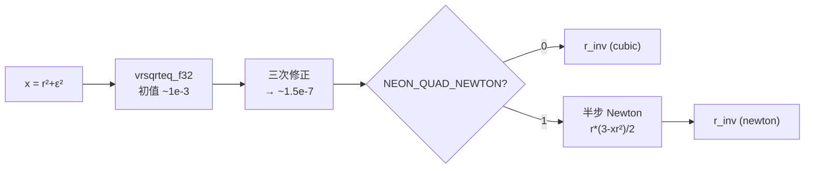

# NEON 四极内核：rsqrt 额外半步 Newton 的代价与精度对比

- 日期：2026-09-24
- 机器：tsv110（HiSilicon Kunpeng-920 / TSV110，24 核，~2.59 GHz）
- 对象：`src/force_tsv110.hpp` 中 `CalcForceEpSpQuadNeon` 使用的倒数平方根
  - **cubic**：`rsqrt4()` = `vrsqrteq_f32` + 三次修正 $r=r_0[1+h(\tfrac12+\tfrac38h)]$
  - **newton**：cubic + 一步半步 Newton $r \leftarrow r(3-x r^2)/2$（与 `force_fugaku.hpp:829-833, 1112-1116` 完全一致）
- 实现：编译期宏 `NEON_QUAD_NEWTON`（默认 0），代码见 `force_tsv110.hpp` 的 `rsqrt4_quad()`
- 结论：**保持默认关闭（cubic）**——半步 Newton 不提升精度（已到 F32 舍入极限），却使四极内核变慢约 **20%**

---

## 1. 背景

Fugaku 的四极内核在三次修正后又加了一步半步 Newton。NEON 版此前只做了三次修正。两者都是 F32，问题在于：这额外一步对精度是否有帮助、代价多大？为此建立本子模块做独立对比。



## 2. 测试方法

| 测试 | 程序 | 内容 |
|---|---|---|
| r_inv 精度 | `rsinv` | x 对数均匀取自 $[10^{-4},10^4]$，n=2×10⁶，对比 `1/sqrt(x)`（F64）；输出 max/mean/RMS/p50/p90/p99 与 CDF 直方图 |
| r_inv 吞吐 | `rsinv` | 8 路独立操作循环，5×10⁸ 次，取墙钟 ns/op |
| 力/势误差 | `qn_cubic` / `qn_newton` | 与 `CalcForceEpSpQuadNoSimd`（F64 参考）逐粒子比较；3 组动态范围（scale=1/10、offset=0/10⁶）× 3 个随机种子；输出 max/mean/RMS/分位数 |
| 内核计时 | `qn_cubic` / `qn_newton` | 5×5 尺寸网格（n_i∈{4…1024}，n_j∈{8…2048}），每次调用整函子（含打包/选择器），取 8 次扫描的中位数 |
| mass>0 对齐 | `qn_cubic` + `masszero` | EP-EP：1/3 的 EPJ 质量为零，检验 NEON 与“过滤后的 NoSimd”一致 |

复现：`bash build.sh && bash run.sh && python3 make_figs.py`（需 AArch64 + NEON；用 `PETAR=...` 指向含新 `force_tsv110.hpp` 的 PeTar 源码）。

## 3. 结果

### 3.1 r_inv 精度：两者都已达到 F32 舍入极限


| 方法 | max | mean | RMS | p50 | p90 | p99 |
|---|---|---|---|---|---|---|
| cubic | 1.46×10⁻⁷ | 2.51×10⁻⁸ | 3.06×10⁻⁸ | 2.23×10⁻⁸ | 4.93×10⁻⁸ | 7.38×10⁻⁸ |
| cubic + 半步 Newton | 1.25×10⁻⁷ | 2.65×10⁻⁸ | 3.34×10⁻⁸ | 2.23×10⁻⁸ | 5.48×10⁻⁸ | 8.83×10⁻⁸ |

- 两条 CDF 曲线基本重合；半步 Newton 的 max 略小、mean/p90/p99 略大——差异纯属额外舍入，**没有系统性收益**。
- 原因：三次修正后误差已 ~10⁻⁷（F32 eps≈1.2×10⁻⁷），半步 Newton 的修正量被舍入噪声淹没；该步骤对初值误差 ~10⁻³ 的原始估计才有意义。
- 距离内核容差 7×10⁻³ 有 5 个数量级余量。

### 3.2 r_inv 吞吐：额外依赖链很贵

| 方法 | ns/vector-op（4 lane） |
|---|---|
| cubic | 3.68 |
| cubic + 半步 Newton | 6.89（**×1.87**） |

半步 Newton 的 3 条指令落在 `r_inv` 的关键依赖链上（估计→修正→r²→修正量→乘回），在 TSV110 上直接使该序列接近翻倍。

### 3.3 力/势误差：与 NoSimd F64 对比无差别


代表性数据（n_i=1000, n_sp=2000，max 相对误差）：

| 配置 | cubic \|acc\| | newton \|acc\| | cubic pot | newton pot |
|---|---|---|---|---|
| scale=1, seed=1 | 2.85×10⁻⁵ | 3.01×10⁻⁵ | 1.08×10⁻⁴ | 1.17×10⁻⁴ |
| scale=1, seed=2 | 1.99×10⁻⁵ | 1.99×10⁻⁵ | 5.07×10⁻⁴ | 4.87×10⁻⁴ |
| scale=1, seed=3 | 1.39×10⁻⁵ | 1.39×10⁻⁵ | 1.24×10⁻⁴ | 1.24×10⁻⁴ |
| scale=10, seed=2 | 1.71×10⁻⁵ | 1.71×10⁻⁵ | 6.78×10⁻⁴ | 6.78×10⁻⁴ |
| offset=10⁶（平移项） | 与 offset=0 逐位一致 | 同左 | 同左 | 同左 |

- 两种变体的误差分布几乎重合，差异在 ±5% 的舍入噪声内，且有时 newton 更大。
- 误差量级由其他 F32 舍入（四极项的组合/求和）主导，`r_inv` 精度不是瓶颈。
- `offset=10⁶` 与 `offset=0` 的**逐位一致**结果同时验证了 SP 内核的原点平移有效。

### 3.4 内核计时：真实尺寸下 +17%…+25%


- 比值热图（newton/cubic，8 次扫描中位数）：
  - 极小尺寸（(4,8)/(4,32)/(16,8)，走 I4_J1 或固定开销主导）：0.999–1.001（无差别）
  - 所有 n_j≥128 的格子：**1.170–1.253**
  - 全网格几何平均：**1.198**
- 左图（n_i=256）：cubic 每交互 ~7.5–11 ns，newton ~9.5–12.5 ns；NoSimd F64 约 44 ns（未变）。
- 换算到端到端：四极内核占树力约一半、树力在大 N 占每步约 50–70%，预计总时间增加 ~6–10%；无任何精度回报。

### 3.5 附：EP-EP 的 mass>0 对齐

按 Fugaku/x86 SIMD 语义，NEON EP-EP 现在跳过 `mass<=0` 的 EPJ（I4_J1 先压缩、I1_J4 过滤+打包一趟完成）。验证（n_i=1000，n_j=2000，1/3 零质量）：

```
MASSZERO,neon_cubic,1000,2000,...,acc_max=6.84e-06,pot_max=4.18e-07,
  nnb_mismatch_vs_filtered=0, nnb_mismatch_unfiltered_nosimd_vs_filtered=782
```

- NEON 与“过滤后的 NoSimd 参考”**邻居数完全一致**（0/1000 失配）；
- 未过滤的旧语义会让 782/1000 个粒子的邻居数不同 → 对齐改变了预期行为；
- 性能代价：过滤前后 EP-EP 内核计时几何平均比值 **1.0002**（最大 1.004）——可忽略。

## 4. 结论与决策

| | cubic（默认） | cubic + 半步 Newton |
|---|---|---|
| r_inv max 误差 | 1.46×10⁻⁷ | 1.25×10⁻⁷ |
| 力/势误差 | 基准 | 无改善（±舍入） |
| 四极内核耗时 | 基准 | **+20%（1.17–1.25×）** |
| 与 Fugaku 位级一致 | 否 | 是 |

**决策：`NEON_QUAD_NEWTON` 默认保持 0（cubic）。** 理由是实测无精度收益、有明显性能代价；宏与 `rsqrt4_quad()` 保留在代码中并附本报告，供需要与 Fugaku 逐位对齐时使用（`-DNEON_QUAD_NEWTON=1`）。

## 5. 复现

```bash
cd tsv110-bench/quad_newton
PETAR=/path/to/PeTar-with-force_tsv110 bash build.sh
bash run.sh
python3 make_figs.py
```

原始数据在 `data/`：`rsinv_*.csv`、`errors.csv`、`errdump_*.csv`、`timing.csv`、`masszero.csv`、`epep_old.csv`/`epep_new.csv`。
