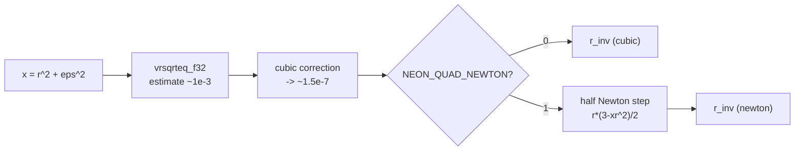
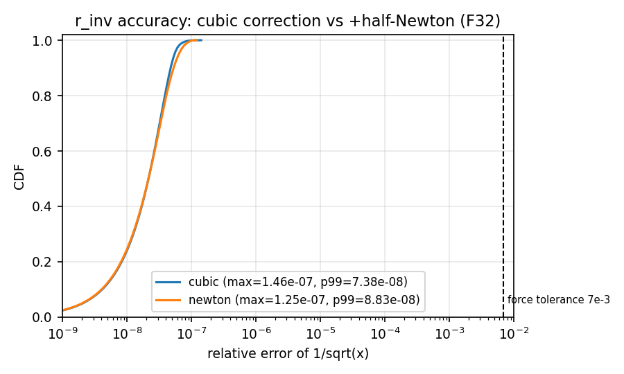
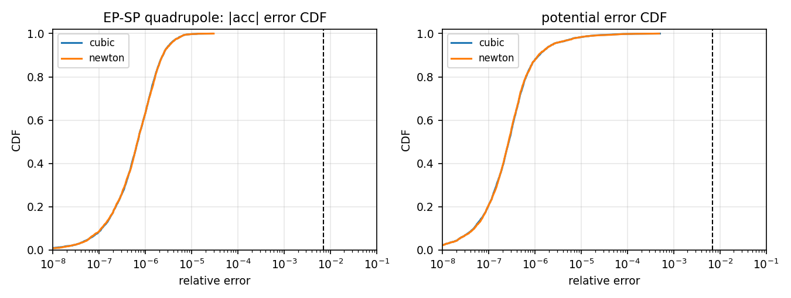
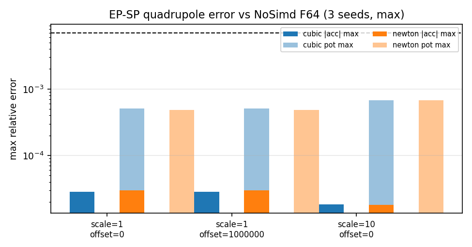
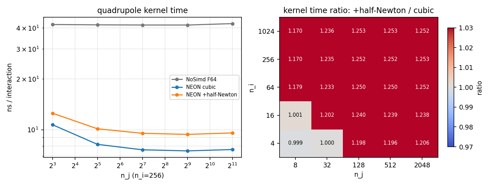

# NEON quadrupole kernel: cost and accuracy of the extra half Newton step in rsqrt

- Date: 2026-09-24
- Platform: HiSilicon Kunpeng-920 (TSV110 core, 24 cores, ~2.59 GHz)
- Object: the reciprocal square root used by `CalcForceEpSpQuadNeon` in `src/force_tsv110.hpp`
  - **cubic**: `rsqrt4()` = `vrsqrteq_f32` + cubic correction $r=r_0[1+h(\tfrac12+\tfrac38h)]$
  - **newton**: cubic + one half Newton step $r \leftarrow r(3-x r^2)/2$ (identical to `force_fugaku.hpp:829-833, 1112-1116`)
- Implementation: compile-time macro `NEON_QUAD_NEWTON` (default 0), see `rsqrt4_quad()` in `force_tsv110.hpp`
- Conclusion: **keep it disabled (cubic) by default** -- the half Newton step does not improve accuracy (the cubic correction already reaches the F32 rounding limit) but makes the quadrupole kernel about **20% slower**

---

## 1. Background

The Fugaku quadrupole kernel adds a half Newton step after the cubic correction, while the NEON version originally used the cubic correction only. Both are F32; the question is whether the extra step helps accuracy and what it costs. This standalone study was set up to answer that question.



## 2. Test Method

| Test | Program | Content |
|---|---|---|
| r_inv accuracy | `rsinv` | x log-uniform in $[10^{-4},10^4]$, n=2x10^6, compared with `1/sqrt(x)` (F64); reports max/mean/RMS/p50/p90/p99 and a CDF histogram |
| r_inv throughput | `rsinv` | 8 independent chains, 5x10^8 iterations, wall-clock ns/op |
| Force/potential error | `qn_cubic` / `qn_newton` | Per-particle comparison against `CalcForceEpSpQuadNoSimd` (F64 reference); 3 dynamic-range configurations (scale=1/10, offset=0/10^6) x 3 random seeds; reports max/mean/RMS/percentiles |
| Kernel timing | `qn_cubic` / `qn_newton` | 5x5 size grid (n_i in {4...1024}, n_j in {8...2048}), timing the whole functor call (including packing/selector), median of 8 scans |
| mass>0 alignment | `qn_cubic` + `masszero` | EP-EP: one third of the EPJ entries have zero mass; checks that NEON matches the "filtered NoSimd" reference |

The benchmark sources and raw data are under `data/` (AArch64 + NEON required).

## 3. Results

### 3.1 r_inv accuracy: both variants already sit at the F32 rounding limit



| Method | max | mean | RMS | p50 | p90 | p99 |
|---|---|---|---|---|---|---|
| cubic | 1.46x10^-7 | 2.51x10^-8 | 3.06x10^-8 | 2.23x10^-8 | 4.93x10^-8 | 7.38x10^-8 |
| cubic + half Newton | 1.25x10^-7 | 2.65x10^-8 | 3.34x10^-8 | 2.23x10^-8 | 5.48x10^-8 | 8.83x10^-8 |

- The two CDF curves almost coincide; the half Newton step has a slightly smaller max but slightly larger mean/p90/p99 -- pure extra rounding, **no systematic benefit**.
- Reason: after the cubic correction the error is already ~10^-7 (F32 eps is about 1.2x10^-7), so the correction computed by the half Newton step is buried in rounding noise. That step only makes sense for a raw estimate with an error of ~10^-3.
- Both are five orders of magnitude below the kernel tolerance of 7x10^-3.

### 3.2 r_inv throughput: the extra dependency chain is expensive

| Method | ns per vector op (4 lanes) |
|---|---|
| cubic | 3.68 |
| cubic + half Newton | 6.89 (**1.87x**) |

The three instructions of the half Newton step sit on the critical dependency chain of `r_inv` (estimate -> correction -> r^2 -> correction term -> multiply back), which on the TSV110 almost doubles the cost of that sequence.

### 3.3 Force/potential error: indistinguishable from the NoSimd F64 reference





Representative data (n_i=1000, n_sp=2000, maximum relative error):

| Configuration | cubic \|acc\| | newton \|acc\| | cubic pot | newton pot |
|---|---|---|---|---|
| scale=1, seed=1 | 2.85x10^-5 | 3.01x10^-5 | 1.08x10^-4 | 1.17x10^-4 |
| scale=1, seed=2 | 1.99x10^-5 | 1.99x10^-5 | 5.07x10^-4 | 4.87x10^-4 |
| scale=1, seed=3 | 1.39x10^-5 | 1.39x10^-5 | 1.24x10^-4 | 1.24x10^-4 |
| scale=10, seed=2 | 1.71x10^-5 | 1.71x10^-5 | 6.78x10^-4 | 6.78x10^-4 |
| offset=10^6 (shift term) | bit-identical to offset=0 | same | same | same |

- The two error distributions almost coincide; the differences are within the +/-5% rounding noise, and newton is sometimes worse.
- The error magnitude is dominated by other F32 roundings (the combination and summation of the quadrupole terms); `r_inv` accuracy is not the bottleneck.
- The **bit-identical** results for offset=10^6 and offset=0 also confirm that the origin shift of the SP kernel works.

### 3.4 Kernel timing: +17%...+25% at realistic sizes



- Ratio heatmap (newton/cubic, median of 8 scans):
  - tiny sizes ((4,8)/(4,32)/(16,8), I4_J1 or fixed-overhead dominated): 0.999-1.001 (no difference)
  - every cell with n_j>=128: **1.170-1.253**
  - geometric mean over the whole grid: **1.198**
- Left panel (n_i=256): cubic ~7.5-11 ns per interaction, newton ~9.5-12.5 ns; NoSimd F64 stays at about 44 ns.
- Scaling to the full simulation: the quadrupole kernel is roughly half of the tree force, and the tree force is 50-70% of a step at large N, so the expected total increase is ~6-10% with no accuracy return whatsoever.

### 3.5 Side note: the EP-EP mass>0 alignment

Following the Fugaku/x86 SIMD semantics, the NEON EP-EP kernels now skip EPJ entries with `mass<=0` (I4_J1 compacts first; I1_J4 filters and packs in a single pass). Validation (n_i=1000, n_j=2000, one third of the entries massless):

```
MASSZERO,neon_cubic,1000,2000,...,acc_max=6.84e-06,pot_max=4.18e-07,
  nnb_mismatch_vs_filtered=0, nnb_mismatch_unfiltered_nosimd_vs_filtered=782
```

- NEON matches the "filtered NoSimd reference" exactly in the neighbor counts (0/1000 mismatches);
- the old, unfiltered semantics would give a different neighbor count for 782/1000 particles, so the alignment does change the expected behavior;
- cost: the geometric-mean ratio of the EP-EP kernel timing before and after the filter is **1.0002** (max 1.004) -- negligible.

## 4. Conclusion and Decision

| | cubic (default) | cubic + half Newton |
|---|---|---|
| r_inv max error | 1.46x10^-7 | 1.25x10^-7 |
| force/potential error | baseline | no improvement (within rounding) |
| quadrupole kernel time | baseline | **+20% (1.17-1.25x)** |
| bit-level agreement with Fugaku | no | yes |

**Decision: keep `NEON_QUAD_NEWTON` at its default of 0 (cubic).** The measurements show no accuracy benefit and a clear performance cost; the macro and `rsqrt4_quad()` remain in the code with this report for cases that need bit-level agreement with Fugaku (`-DNEON_QUAD_NEWTON=1`).

Raw data and benchmark sources are in `data/`: `rsinv_*.csv`, `errors.csv`, `errdump_*.csv`, `timing.csv`, `masszero.csv`, `epep_old.csv`/`epep_new.csv`.
